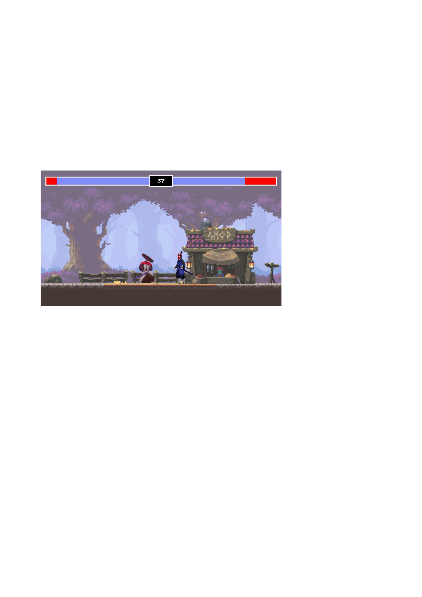

# Fighting game 2d

## Table of Contents
[Overview]
[Tools]
[Usage]
[Contact]

**Overview**:
- A personal basic 2d fighting game ("because i love games"). The application presents users with players (fighters) to show their sword-slashing skills. It uses majorly javascript for the UI layout and would be upscaled using either react or Angular and more fighters (COMING SOON !!!).

**Tools**:
- HTML5
- SCSS,
- JavaScript ES6 languages
- Bootstrap (cdn, gsap)
- Various linteres for the correction of possible code errors

 **Project set up**
- create player
- event listeners move characters 
- attacks 
- health bar (sprites)
- game timers and game over 
- Sprites and animation
- download and add an environment asset pack
- dowload and add fighters asset pack (more fighters coming soon)
- adjust background to fit canvas 

*player 1 and 2 animation*
- idle
- run 
- attack
- jump
- react to the sprite attacks
- receive hit animation
- death animation

**other requirements**
- push live
- adaptation  for pad (tbd)
- run on unity engine (tbd)

**usage**:
- To view and use the app, fork the 'index html' code from my github reppository and  open directly in your web browser.

[live demo link]
(https://https://marktonyfighting-game.netlify.app/)

**Contact**:
- Udennaka Marktony
- cloudsensei@yahoo.com / chukwudiudennaka@gmail.com
- https://github.com/marktony1348/fighting-game

*credits: code along with @chriscourses*

